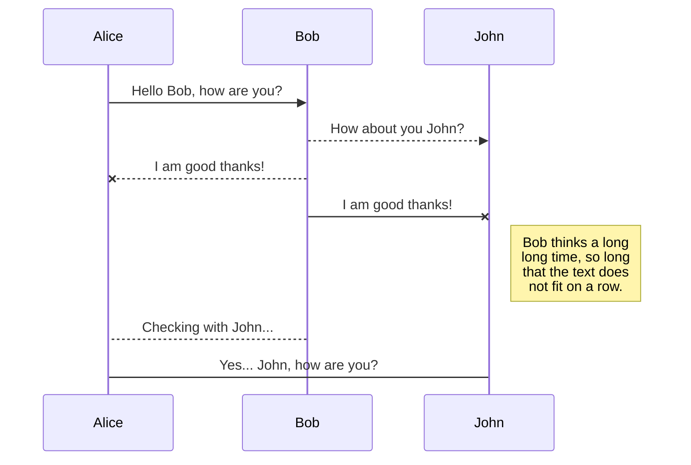
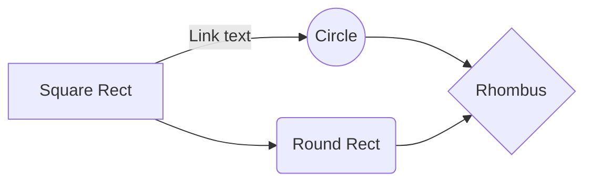

# Welcome to our mini project!

Hi! I'm your first Markdown file in **StackEdit**. If you want to learn about StackEdit, you can read me. If you want to play with Markdown, you can edit me. Once you have finished with me, you can create new files by opening the **file explorer** on the left corner of the navigation bar.

## Create files and folders

The file explorer is accessible using the button in left corner of the navigation bar. You can create a new file by clicking the **New file** button in the file explorer. You can also create folders by clicking the **New folder** button.

## Switch to another file

` funtion addNum(a,b)`

## Server (player1)

```
git clone https://github.com/baseboy1102002/sgu_ossd_tictactoe.git
python player1.py
```

## Client (player2)

```
git clone https://github.com/baseboy1102002/sgu_ossd_tictactoe.git
python player2.py
```

# Synchronization

Synchronization is one of the biggest features of StackEdit. It enables you to synchronize any file in your workspace with other files stored in your **Google Drive**, your **Dropbox** and your **GitHub** accounts. 

There are two types of synchronization and they can complement each other:

- The workspace synchronization will sync all your files.
- The workspace synchronization will sync all your files.
- The workspace synchronization will sync all your files.
	> To start syncing your workspace, just sign in with Google in the menu.

Synchronization is one of the biggest features of StackEdit
> Before starting to sync files, you must link an account in the **Synchronize** sub-menu.


# Publication

Publishing in StackEdit makes it simple for you to publish online your files. With [Handlebars templates](http://handlebarsjs.com/), you have full control over what you export.

> Before starting to publish, you must link an account in the **Publish** sub-menu.


## UML diagrams

You can render UML diagrams using [Mermaid](https://mermaidjs.github.io/). For example, this will produce a sequence diagram:



And this will produce a flow chart:


